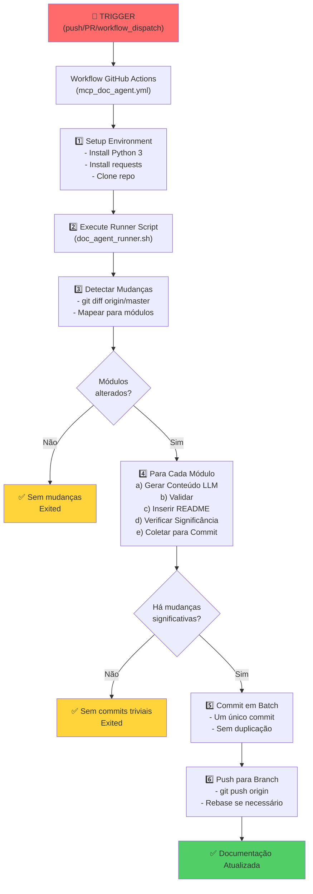

# MCP Documentation Agent - Guia Completo de Funcionamento

## 📋 Índice
1. [Visão Geral](#visão-geral)
2. [Componentes do Sistema](#componentes-do-sistema)
3. [Fluxo de Funcionamento](#fluxo-de-funcionamento)
4. [Arquitetura Detalhada](#arquitetura-detalhada)
5. [Workflow GitHub Actions](#workflow-github-actions)
6. [Implementação Atual](#implementação-atual)
7. [Problemas Resolvidos](#problemas-resolvidos)
8. [Próximas Melhorias](#próximas-melhorias)

---

## 🎯 Visão Geral

O **MCP Documentation Agent** é um sistema automatizado que:
- Detecta mudanças em código Dart nos módulos de features
- Gera documentação automática em Markdown baseada em análise de código
- Atualiza READMEs de forma controlada e consistente
- Mantém histórico limpo de commits sem poluição de linhas em branco

### Objetivo Principal
Manter documentação de módulos/features atualizada automaticamente quando o código muda, reduzindo a necessidade de documentação manual e mantendo a consistência.

---

## 🏗️ Componentes do Sistema

### 1. **Workflow GitHub Actions** (`.github/workflows/mcp_doc_agent.yml`)
- **Trigger:** `push`, `pull_request`, `workflow_dispatch`
- **Ambiente:** Ubuntu Latest
- **Permissões:** `contents: write`
- **Principais etapas:**
  - Instalação do Node.js
  - Instalação do Python e dependências (`requests`)
  - Clonagem do repositório
  - Execução do runner script
  - Autenticação opcional com `AGENT_PUSH_TOKEN`

### 2. **Runner Principal** (`.github/scripts/doc_agent_runner.sh`)
- **Linguagem:** Bash
- **Responsabilidade:** Orquestração principal do processo
- **Principais funções:**
  - Detecta branches e contexto de execução
  - Identifica módulos alterados
  - Chama o gerador de LLM
  - Valida conteúdo gerado
  - Gera/atualiza READMEs
  - Comita e faz push de mudanças

### 3. **Gerador LLM** (`.github/scripts/llm_generate.py`)
- **Linguagem:** Python 3
- **Entrada:** Módulo, repositório root, arquivo de template de prompt
- **Saída:** JSON com campos `markdown`, `confidence`, `module`
- **Modo de operação:**
  - **Remoto (opcional):** Chama API LLM externa via `LLM_API_URL` + `LLM_API_KEY`
  - **Fallback Local:** Gera template conservador com lista de arquivos alterados

### 4. **Validador de Documentação** (`.github/scripts/validate_generated_docs.py`)
- **Linguagem:** Python 3
- **Validações:**
  - Conteúdo não vazio
  - Sem padrões de vazamento de secrets
  - Sanidade básica de blocos Markdown/Mermaid
- **Saída:** JSON com `valid: true/false` e lista de problemas

### 5. **Gerador de README** (`.github/scripts/generate_module_readme.py`)
- **Linguagem:** Python 3
- **Responsabilidade:** Inserir/atualizar bloco auto-gerado no README
- **Estratégia:**
  - Procura por markers `<!-- AUTO-GENERATED DOC START/END -->`
  - Substitui conteúdo entre markers
  - Se markers não existem, cria novo README
  - Atualiza índice central em `docs/features/INDEX.md`

### 6. **Template de Prompt** (`.github/prompts/documentation_agent.prompt.md`)
- **Propósito:** Instruções para o LLM sobre como gerar documentação
- **Conteúdo:**
  - Especificações do formato esperado
  - Exemplos de estrutura de documentação
  - Instruções sobre completeness e qualidade

### 7. **Índice Central** (`docs/features/INDEX.md`)
- **Propósito:** Referência centralizada de todos os módulos documentados
- **Formato:** Lista de links para READMEs dos módulos
- **Atualização:** Automática pelo gerador quando um módulo é documentado

---

## 📊 Fluxo de Funcionamento

### Visão de Alto Nível



### Fluxo Detalhado do Runner Script

```mermaid
graph TD
    A["🔧 Inicialização"] --> A1["Git Config<br/>- user.name/email<br/>- fetch master"]
    A1 --> A2{"Guard:<br/>Último commit<br/>é do agent?"}
    A2 -->|Sim| EXIT1["❌ Exit<br/>Evitar loop"]
    A2 -->|Não| B["🔍 Detecção de Mudanças"]
    
    B --> B1["git diff origin/master...HEAD"]
    B1 --> B2["Filtrar lib/src/modules/*"]
    B2 --> B3["Extrair + Desduplicar<br/>módulos"]
    B3 --> B4{"Módulos<br/>encontrados?"}
    B4 -->|Não| EXIT2["✅ Exit<br/>Sem mudanças"]
    B4 -->|Sim| C["🔄 Loop por Módulo"]
    
    C --> D["4️⃣ Gerar Conteúdo"]
    D --> D1["Chamar llm_generate.py"]
    D1 --> D2{LLM retornou<br/>conteúdo?}
    D2 -->|Não| SKIP1["⏭️ Skip módulo"]
    D2 -->|Sim| E["5️⃣ Validar Conteúdo"]
    
    E --> E1["Chamar validate_generated_docs.py"]
    E1 --> E2{Conteúdo<br/>válido?}
    E2 -->|Não| SKIP2["⏭️ Skip módulo"]
    E2 -->|Sim| F["6️⃣ Atualizar README"]
    
    F --> F1["Chamar generate_module_readme.py"]
    F1 --> F2["Inserir entre markers"]
    F2 --> F3["Atualizar INDEX.md"]
    F3 --> G["7️⃣ Verificar Significância"]
    
    G --> G1["git diff --staged"]
    G1 --> G2["Normalizar linhas"]
    G2 --> G3["Filtrar espaçamento"]
    G3 --> G4{Há mudanças<br/>significativas?}
    G4 -->|Não| G5["🔄 Revert arquivo"]
    G5 --> CONTINUE["Próximo módulo"]
    G4 -->|Sim| G6["✅ Staged para commit"]
    G6 --> CONTINUE
    
    SKIP1 --> CONTINUE
    SKIP2 --> CONTINUE
    
    CONTINUE --> H{Mais módulos?}
    H -->|Sim| C
    H -->|Não| I["8️⃣ Preparação Commit"]
    
    I --> I1{"Detached HEAD<br/>ou PR merge?"}
    I1 -->|Sim| I2["Stash mudanças"]
    I2 --> I3["Fetch + Checkout<br/>branch real"]
    I3 --> I4["Apply stash"]
    I1 -->|Não| J["9️⃣ Commit em Batch"]
    I4 --> J
    
    J --> J1{Há READMEs<br/>no staged?}
    J1 -->|Não| EXIT3["✅ Exit<br/>Sem mudanças"]
    J1 -->|Sim| J2["Verificar diff staged<br/>novamente"]
    J2 --> J3{Significante?}
    J3 -->|Não| J4["🔄 Reverter"]
    J4 --> EXIT3
    J3 -->|Sim| J5["git commit"]
    
    J5 --> K["🔟 Push com Retry"]
    K --> K1["git push<br/>HEAD:refs/heads/<branch>"]
    K1 --> K2{Push<br/>sucesso?}
    K2 -->|Não| K3["git fetch +<br/>git pull --rebase"]
    K3 --> K4["Retry push"]
    K4 --> K5{Sucesso?}
    K5 -->|Não| FAIL["❌ Falha no push"]
    K5 -->|Sim| SUCCESS["✅ Sucesso!"]
    K2 -->|Sim| SUCCESS
    
    style SUCCESS fill:#51CF66
    style EXIT1 fill:#FFD43B
    style EXIT2 fill:#FFD43B
    style EXIT3 fill:#FFD43B
    style FAIL fill:#FF6B6B
    style SKIP1 fill:#FFD43B
    style SKIP2 fill:#FFD43B
```



---

## 🔧 Arquitetura Detalhada

### Estrutura de Diretórios

```
.github/
├── workflows/
│   └── mcp_doc_agent.yml              # Workflow principal
├── scripts/
│   ├── doc_agent_runner.sh            # Runner bash (orquestrador)
│   ├── llm_generate.py                # Gerador de conteúdo
│   ├── validate_generated_docs.py     # Validador
│   ├── generate_module_readme.py      # Insertor de conteúdo
│   └── (futuros: linters, etc.)
├── prompts/
│   └── documentation_agent.prompt.md  # Template de instrução para LLM
├── SETUP_DOC_AGENT.md                 # Instruções de configuração
└── MCP_DOCUMENTATION_AGENT_GUIDE.md   # Este arquivo

lib/src/modules/
├── <module>/
│   ├── README.md                      # Documentação (com markers)
│   ├── presentation/
│   ├── domain/
│   └── infrastructure/

docs/
└── features/
    └── INDEX.md                       # Índice central
```

### Markers de Auto-Geração

Cada README contém markers para delimitação:

```markdown
<!-- AUTO-GENERATED DOC START -->
# Documentação gerada automaticamente
...
<!-- AUTO-GENERATED DOC END -->
```

**Propósito:** Permitir que o agent recoloque apenas o bloco auto-gerado sem perder conteúdo manual.

### Fluxo de Dados JSON

#### llm_generate.py → saída

```json
{
  "module": "auth",
  "markdown": "<!-- AUTO-GENERATED...\n# auth...\n...<!-- AUTO-GENERATED DOC END -->",
  "confidence": 0.6
}
```

#### validate_generated_docs.py → saída

```json
{
  "valid": true,
  "issues": []
}
```

ou

```json
{
  "valid": false,
  "issues": ["Content is empty", "Potential secret leak: AWS_KEY detected"]
}
```

---

## ⚙️ Workflow GitHub Actions

### Arquivo: `.github/workflows/mcp_doc_agent.yml`

```yaml
name: MCP Documentation Agent
on:
  push:
    branches:
      - '**'
  pull_request:
  workflow_dispatch:

permissions:
  contents: write

jobs:
  generate-docs:
    runs-on: ubuntu-latest
    steps:
      # 1. Checkout code
      - uses: actions/checkout@v3
        with:
          fetch-depth: 0  # Full history for git diff

      # 2. Setup Node.js (if needed)
      - uses: actions/setup-node@v3
        with:
          node-version: '18'

      # 3. Setup Python
      - uses: actions/setup-python@v4
        with:
          python-version: '3.10'

      # 4. Install Python dependencies
      - name: Install Python dependencies
        run: pip install requests

      # 5. Setup Git identity
      - name: Configure Git
        run: |
          git config --global user.name "MCP Documentation Agent"
          git config --global user.email "mcp-docs-bot@users.noreply.github.com"

      # 6. Optional: Setup GH CLI auth
      - name: Setup GH CLI
        if: secrets.GH_TOKEN != ''
        run: gh auth login --with-token <<< "${{ secrets.GH_TOKEN }}"

      # 7. Setup Git remote with token (if provided)
      - name: Configure Git remote with token
        if: secrets.AGENT_PUSH_TOKEN != ''
        run: |
          git remote set-url origin "https://x-access-token:${{ secrets.AGENT_PUSH_TOKEN }}@github.com/${{ github.repository }}.git"

      # 8. Execute doc agent runner
      - name: Run MCP Documentation Agent
        run: chmod +x .github/scripts/doc_agent_runner.sh && ./.github/scripts/doc_agent_runner.sh

      # 9. Upload logs (optional)
      - name: Upload logs on failure
        if: failure()
        uses: actions/upload-artifact@v3
        with:
          name: doc-agent-logs
          path: /tmp/doc-agent-*.log
```

### Variáveis de Ambiente Esperadas

| Variável | Tipo | Obrigatória | Descrição |
|----------|------|-------------|-----------|
| `AGENT_PUSH_TOKEN` | Secret | ❌ Não | PAT para push em branches protegidas |
| `GH_TOKEN` | Secret | ❌ Não | Token GitHub para CLI auth |
| `LLM_API_URL` | Env | ❌ Não | URL da API LLM remota (fallback local se ausente) |
| `LLM_API_KEY` | Secret | ❌ Não | Chave de autenticação da API LLM |

---

## 📝 Implementação Atual

### Estado do Código

#### ✅ Funcionalidades Implementadas

1. **Detecção de Mudanças**
   - [x] Git diff contra origin/master
   - [x] Mapeamento de arquivos para módulos
   - [x] Deduplicação de módulos alterados

2. **Geração de Conteúdo**
   - [x] Integração com LLM remoto (opcional)
   - [x] Fallback local com template conservador
   - [x] Cálculo de confiança
   - [x] Tratamento de erros gracioso

3. **Validação**
   - [x] Verificação de conteúdo não-vazio
   - [x] Detecção de padrões de vazamento de secrets
   - [x] Validação de Markdown básica
   - [x] Rejeição de conteúdo inválido

4. **Atualização de README**
   - [x] Substitução entre markers
   - [x] Criação de novo README se necessário
   - [x] Atualização de índice central
   - [x] Formatação limpa (sem linhas extras)

5. **Controle de Commit**
   - [x] Detecção de mudanças significativas vs. triviais
   - [x] Filtragem de espaçamento em branco
   - [x] Batch commit único por execução
   - [x] Guard contra loops infinitos

6. **Navegação de Branch**
   - [x] Suporte a push direto
   - [x] Suporte a pull_request (detached HEAD)
   - [x] Suporte a workflow_dispatch
   - [x] Inferência robusta de nome de branch
   - [x] Stash/apply para evitar merge commits

7. **Compatibilidade**
   - [x] Python 3.7+ (type hints com `Optional`)
   - [x] Bash portável (sem `mapfile`)
   - [x] Import condicional de dependências
   - [x] Fallback quando requests não instalado

#### ⚙️ Configuração Necessária

```bash
# Secrets necessários em repo settings:
AGENT_PUSH_TOKEN=ghp_xxxxxxxxxxxxxxxxxxxx  # (opcional, recomendado)
GH_TOKEN=ghp_xxxxxxxxxxxxxxxxxxxx          # (opcional)
LLM_API_URL=https://api.example.com/...   # (opcional)
LLM_API_KEY=sk_xxxxxxxxxxxxxxxx            # (opcional)
```

#### 📋 Exemplo de Execução Completa

```
[mcp-doc-agent] Starting runner
From https://github.com/MarquiThiago/Donezy
 * [new branch]      master     -> origin/master
Changed files:
lib/src/modules/note/presentation/pages/note_detail_page.dart
lib/src/modules/note/presentation/widgets/item_card.dart
lib/src/modules/note/presentation/pages/notes_page.dart
...
Modules affected: note auth
Operating on branch: feat/redesign-task-card

Processing module: note
Calling LLM to generate content for module note
{"valid": true, "issues": []}
Updated auto-generated block in lib/src/modules/note/README.md
Significant changes detected for lib/src/modules/note/README.md; staging for batch commit

Processing module: auth
Calling LLM to generate content for module auth
{"valid": true, "issues": []}
Updated auto-generated block in lib/src/modules/auth/README.md
No README changes for auth after generator run

Preparing to commit README changes for modules: lib/src/modules/note/README.md
[feat/redesign-task-card abc1234] docs(agent): automated update for modules: lib/src/modules/note/README.md
1 file changed, 20 insertions(+), 5 deletions(-)
To https://github.com/MarquiThiago/Donezy.git
   abc1234..def5678  HEAD -> feat/redesign-task-card
Committed and pushed batch updates for modules: lib/src/modules/note/README.md

Runner finished
```

---

## 🐛 Problemas Resolvidos

### 1. **Commits Vazios com Apenas Espaçamento**
- **Problema:** Agent commitava READMEs mesmo quando apenas linhas em branco eram adicionadas
- **Causa:** Gerador adicionava `\n` extras; falta de verificação de significância no staged diff
- **Solução:**
  - Remover `\n` literais no `llm_generate.py`
  - Melhorar formatação no `generate_module_readme.py`
  - Adicionar verificação perl robusta no runner para filtrar espaçamento

### 2. **Unbound Variable: CHANGED_READMES**
- **Problema:** Script falhava com erro `CHANGED_READMES: unbound variable`
- **Causa:** Array não inicializado no início do loop
- **Solução:** Adicionar `CHANGED_READMES=()` antes do loop de processamento

### 3. **Comando `mapfile` Não Disponível**
- **Problema:** Script falhava em `/bin/sh` (não `/bin/bash`)
- **Causa:** `mapfile` é bash-specific; runner usava shell padrão
- **Solução:** Substituir por loop portável:
  ```bash
  UNIQUE_MODULES=()
  while IFS= read -r module; do
    UNIQUE_MODULES+=("$module")
  done < /tmp/mcp_modules.txt
  ```

### 4. **Erro de Tipo Python: `str | None`**
- **Problema:** Script falhava em Python 3.9 com "unsupported operand type(s) for |"
- **Causa:** Sintaxe de union types (`|`) é Python 3.10+
- **Solução:** Usar `Optional[str]` com `from typing import Optional`

### 5. **Missing requests Module**
- **Problema:** ImportError quando `requests` não estava instalado
- **Causa:** Workflow não instalava dependências Python
- **Solução:** 
  - Adicionar `pip install requests` no workflow
  - Fazer import condicional no script

### 6. **Merge Commits Poluidores**
- **Problema:** Agent commitava no merge commit de PRs (refs/pull/*/merge)
- **Causa:** Detached HEAD em pull_request context
- **Solução:**
  - Detectar refs/pull/*/merge ou detached HEAD
  - Stash mudanças
  - Checkout branch real: `git checkout -B <branch> origin/<branch>`
  - Apply stash
  - Commit na branch real (não no merge)

### 7. **Push Rejeitado: Ambiguous Ref**
- **Problema:** "The destination you provided is not a full refname"
- **Causa:** Push para HEAD implícito em detached HEAD
- **Solução:** Usar refspec explícito: `git push origin HEAD:refs/heads/<branch>`

### 8. **Conflitos de Merge Rebase**
- **Problema:** Script local tentava rebase quando múltiplas execuções simultâneas
- **Causa:** Duas execuções do agent tentavam commitar ao mesmo tempo
- **Solução:** Tratamento gracioso com `git pull --rebase` e retry de push

### 9. **Git Identity Unknown**
- **Problema:** "Author identity unknown" / "fatal: empty ident name"
- **Causa:** Git config de user.name/email não setado no workflow
- **Solução:** Adicionar `git config user.name/email` no workflow + runner

### 10. **Infinite Loops de Documentação**
- **Problema:** Agent re-documentava seu próprio commit infinitamente
- **Causa:** Sem guard contra commits do próprio agent
- **Solução:** Verificar último commit:
  ```bash
  LAST_AUTHOR=$(git log -1 --pretty=format:'%an')
  if [ "$LAST_AUTHOR" = "MCP Documentation Agent" ]; then exit 0; fi
  ```

---

## 🚀 Próximas Melhorias

### Melhorias de Curto Prazo

- [ ] **Linting de Markdown**
  - Adicionar `markdownlint` ao workflow
  - Validar formato e estrutura de documentação
  - Rejeitar docs com problemas estruturais

- [ ] **Parsing de Mermaid**
  - Validar diagramas Mermaid gerados
  - Certificar sintaxe válida antes de inserir

- [ ] **Confiança do LLM**
  - Usar score de confiança para decisão: commit direto vs. draft PR
  - Se `confidence < threshold`: criar draft PR em vez de commit direto

- [ ] **Detecção de Conteúdo Duplicado**
  - Evitar conteúdo repetido entre runs
  - Normalizar datas/timestamps antes de comparação

### Melhorias de Médio Prazo

- [ ] **Documentação de Data Flow**
  - Gerar diagramas de fluxo de dados automaticamente
  - Analisar BLoCs e mapear estados

- [ ] **Documentação de Rotas**
  - Extrair rotas do `app_routes.dart` automaticamente
  - Gerar tabela de navegação

- [ ] **Testes de Documentação**
  - Validar que classes/métodos documentados existem
  - Alertar se documentação refere a código inexistente

- [ ] **Suporte a Múltiplos LLMs**
  - Abstrair interface de LLM
  - Suportar OpenAI, Claude, Gemini, etc.

- [ ] **Cache de Documentação**
  - Evitar re-geração se módulo não mudou
  - Cache em S3 ou GitHub Actions cache

### Melhorias de Longo Prazo

- [ ] **Análise Estática Avançada**
  - AST parsing de Dart
  - Extração automática de APIs públicas
  - Mapeamento de dependências internas

- [ ] **Documentação Interativa**
  - Links clicáveis entre módulos
  - Visualização em dashboard

- [ ] **Integração com Code Review**
  - Comentário automático em PRs
  - Sugestões de melhoria de documentação

- [ ] **Histórico de Mudanças**
  - Changelog automático
  - Rastreamento de quando APIs mudaram

- [ ] **Tradução Automática**
  - Gerar docs em múltiplos idiomas
  - PT-BR, EN, ES, etc.

---

## 📊 Métricas e Monitoramento

### Informações a Coletar

```bash
# No workflow, coletar:
- Tempo de execução total
- Número de módulos processados
- Número de mudanças detectadas
- Taxa de sucesso de commits
- Tamanho de commits (bytes)
- Número de linhas adicionadas/removidas
```

### Logs de Debug Úteis

```bash
# O runner atualmente imprime:
[mcp-doc-agent] Starting runner
Changed files: ...
Modules affected: ...
Processing module: ...
Calling LLM to generate content for module ...
Updated auto-generated block in ...
Significant changes detected ...
Staged for batch commit
Committed and pushed batch updates
```

### Alertas a Implementar

- ❌ LLM API timeout
- ❌ Validação falhou
- ❌ Push rejeitado 3x
- ❌ Módulo detalhado mas sem perda data anterior

---

## 🔐 Segurança

### Checklist de Segurança Implementada

- [x] **Secrets Seguros**
  - Usar `secrets.AGENT_PUSH_TOKEN` (não hardcoded)
  - Usar `secrets.LLM_API_KEY` (não exposto em logs)

- [x] **Prevenção de Injection**
  - Validar conteúdo gerado antes de inserir
  - Não executar código gerado

- [x] **Detecção de Vazamento de Secrets**
  - Validador verifica padrões comuns (AWS_KEY, PRIVATE_KEY, etc.)

- [x] **Permissões Mínimas**
  - Workflow só tem `contents: write` (não admin)

- [x] **Auditoria**
  - Commits assinados com identity clara
  - Histórico rastreável

### Futuras Melhorias de Segurança

- [ ] Assinatura GPG de commits
- [ ] Verificação de reputação do LLM
- [ ] Rate limiting para prevenir spam
- [ ] Análise de padrões anormais de geração

---

## 📚 Referências e Documentação

### Arquivos Importantes

| Arquivo | Propósito | Linguagem |
|---------|-----------|-----------|
| `.github/workflows/mcp_doc_agent.yml` | Workflow automático | YAML |
| `.github/scripts/doc_agent_runner.sh` | Orquestrador principal | Bash |
| `.github/scripts/llm_generate.py` | Gerador de conteúdo | Python 3 |
| `.github/scripts/validate_generated_docs.py` | Validador | Python 3 |
| `.github/scripts/generate_module_readme.py` | Insertor de README | Python 3 |
| `.github/prompts/documentation_agent.prompt.md` | Template de prompt | Markdown |
| `.github/SETUP_DOC_AGENT.md` | Instruções de setup | Markdown |

### Recursos Externos

- [GitHub Actions Documentation](https://docs.github.com/en/actions)
- [Bash Scripting Best Practices](https://google.github.io/styleguide/shellstyle.html)
- [Python typing](https://docs.python.org/3/library/typing.html)
- [Git Workflows](https://git-scm.com/book/en/v2)

---

## 🎓 Como Usar Este Guia Para Desenvolvimento

### Identificar Problemas

1. **Verifique a seção de "Problemas Resolvidos"** — seu problema pode já estar lá
2. **Trace o fluxo** — use o fluxograma para entender em qual etapa a falha ocorre
3. **Verifique logs do workflow** — GitHub Actions mostra exatamente onde falhou
4. **Teste localmente** — execute `.github/scripts/doc_agent_runner.sh` na sua máquina

### Propor Melhorias

1. **Identifique a categoria** — automação, qualidade, segurança, UX?
2. **Valide com este guia** — garanta que é compat com fluxo existente
3. **Implemente incrementalmente** — mude um arquivo por vez
4. **Teste completamente** — commit local + push para triggerar workflow

### Debugar Falhas

```bash
# No seu local:
export GH_TOKEN=<seu_token>
export AGENT_PUSH_TOKEN=<seu_pat>

# Execute manualmente:
chmod +x .github/scripts/doc_agent_runner.sh
./.github/scripts/doc_agent_runner.sh

# Verifique output completo para entender o fluxo
```

---

## ✅ Checklist de Funcionalidade

Use este checklist para validar que tudo está funcionando:

- [ ] Workflow dispara em `push`
- [ ] Workflow dispara em `pull_request`
- [ ] Mudanças em módulos são detectadas
- [ ] LLM (ou fallback) gera conteúdo
- [ ] Conteúdo gerado passa validação
- [ ] README é atualizado com novo conteúdo
- [ ] Mudanças significativas são detectadas
- [ ] Commits triviais (só espaço) são ignorados
- [ ] Um único commit batch é criado
- [ ] Commit é feito na branch correta
- [ ] Push é bem-sucedido
- [ ] Índice central é atualizado
- [ ] Logs são informativos
- [ ] Não há loops infinitos

---

**Última Atualização:** 19 de Dezembro de 2025  
**Versão:** 1.0  
**Autor:** MCP Documentation Agent Implementation
