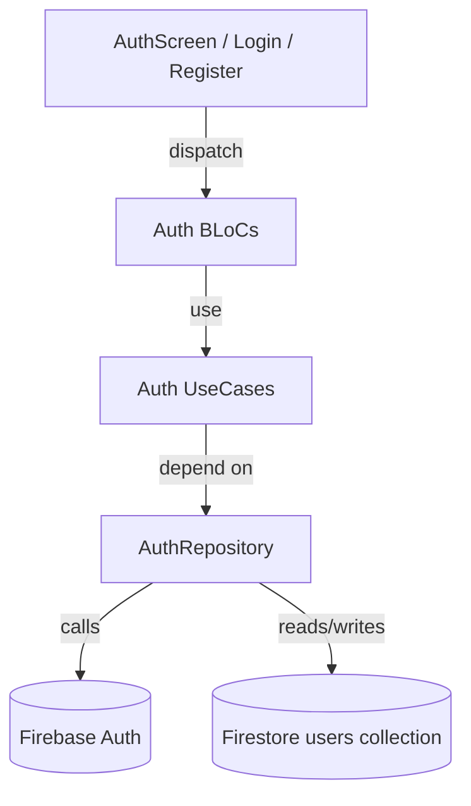
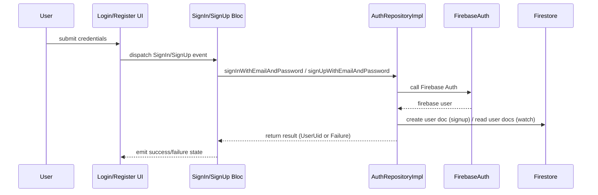

# Auth Feature — Documentation

**Short description:** Authentication feature providing email/password sign-in and sign-up flows, sign-out, and auth-state monitoring using Firebase Auth and Firestore user profiles.

**Metadata**
- **Module:** `auth`
- **Repository path:** `lib/src/modules/auth/`
- **Branch:** `feat/redesign-task-card`
- **Author / Generated by:** Documentation Agent
- **Date:** 2025-12-17
- **Status:** Draft

---

## Table of Contents
- Summary
- Important constraints
- Architecture overview (components & responsibilities)
- Data flow (diagrams and descriptions)
- Main functionalities & UX flow
- Navigation structure
- APIs & integrations
- Dependencies
- Implementation notes (key files & snippets)
- Tests & verification steps
- Security & privacy
- Troubleshooting & migration notes
- References & links

---

### Summary ✅
This feature handles user authentication: sign in with email/password, sign up with email/password (creates a Firestore user document), sign out, and a continuous auth-status watcher to update application state. The implementation uses Firebase Auth for authentication and Firestore for user profile storage.

### Important constraints ⚠️
- Auth operations require network connectivity and a configured Firebase project.
- Keep secrets and credentials out of docs (do not paste API keys or service account files).
- User creation writes a Firestore document under `users/{uid}`; changes to schema require coordination with consumers.

---

### Architecture overview 🔧
- Presentation: `AuthScreen`, `LoginPage`, `RegisterPage` (Flutter widgets).
- State management: BLoC pattern (`SignInBloc`, `SignUpBloc`, `SignOutBloc`, `WatchAuthBloc`).
- Domain: `AuthRepository` interface (`signIn`, `signUp`, `signOut`, `authStatusStream`).
- Infrastructure: `AuthRepositoryImpl` (Firebase Auth + Firestore helpers), DTOs and exception handling.

Mermaid component diagram:



---

### Data flow 💡
- Sign-in flow: UI -> SignInBloc -> AuthRepository.signInWithEmailAndPassword -> FirebaseAuth -> return UserUid -> app updates state.
- Sign-up flow: UI -> SignUpBloc -> AuthRepository.signUpWithEmailAndPassword -> FirebaseAuth creates user -> write `users/{uid}` document via Firestore helpers.
- Auth monitoring: `AuthRepositoryImpl` listens to `_firebaseAuth.authStateChanges()`, watches user doc snapshots, and emits `AuthStatus` (authenticated / unauthenticated / failure) on a stream consumed by `WatchAuthBloc`.

Sequence diagram:



---

### Main functionalities & UX flow 🧭
- Sign in with email/password
  - Preconditions: valid email and password; network available.
  - Steps: User completes Login form -> press Sign In -> `SignInBloc` calls repository.
  - Expected results: On success, `WatchAuthBloc` will emit authenticated state and app navigates to main screen.

- Sign up with email/password
  - Preconditions: valid email and strong password; network available.
  - Steps: User completes Register form -> press Register -> `SignUpBloc` calls repository which creates Firebase user and Firestore profile.
  - Expected results: New `users/{uid}` document is created; `WatchAuthBloc` detects auth and app navigates accordingly.

- Sign out
  - Steps: Trigger sign-out from UI (e.g., sign out button) -> `SignOutBloc` or AuthRepository.signOut() is called.
  - Expected results: Firebase session is cleared; `WatchAuthBloc` emits unauthenticated state.

---

### Navigation structure 🗺️
- `AuthScreen` toggles between `LoginPage` and `RegisterPage`.
- After successful authentication, the `WatchAuthBloc` flow should redirect to the app's initial screen (handled by app routing logic).

---

### APIs & integrations 🔗
- Firebase Auth: sign-in, sign-up, sign-out, auth-state changes.
- Firestore: user profiles stored under `users/{uid}`; code uses helpers from `firestore_extension.dart` and `user_firestore_helper.dart`.

Notes about retry/error handling:
- `AuthRepositoryImpl` uses `exceptionHandler` and retries `_init()` on errors with default retry delay (see `CommonDomainConst.defaultRetryDelay`).

---

### Dependencies 📦
- `firebase_auth` — authentication provider.
- `cloud_firestore` — user profile storage.
- `flutter_bloc`, `freezed`, `dartz` — state and domain utilities.

---

### Implementation notes (key files & snippets) 🔍
Key source files:
- `lib/src/modules/auth/presentation/auth_screen.dart` — toggles Login/Register pages.
- `lib/src/modules/auth/presentation/pages/login_page.dart` — Login form with validation and `SignInBloc` usage.
- `lib/src/modules/auth/presentation/pages/register_page.dart` — Register form with `SignUpBloc`.
- `lib/src/modules/auth/infrastructure/auth_repository_impl.dart` — Firebase integration, auth monitoring, and Firestore user doc writes.
- `lib/src/modules/auth/domain/auth_repository.dart` — repository interface.
- `lib/src/modules/auth/blocs/*` — BLoC implementations for sign-in, sign-up, sign-out, watch-auth.

Important snippet — sign-up creates a Firestore user doc:

```dart
await _firestore
  .usersCollection()
  .doc(user.uid)
  .set(
    UserDTO(
      uid: user.uid,
      username: email.split('@')[0],
      displayName: user.displayName,
    ).toJson(),
  );
```

---

### Tests & verification ✅
Verification checklist performed by agent:
- [x] Found UI: `AuthScreen`, `LoginPage`, `RegisterPage`.
- [x] Found repository interface and implementation: `AuthRepository`, `AuthRepositoryImpl`.
- [x] Found BLoCs: `SignInBloc`, `SignUpBloc`, `SignOutBloc`, `WatchAuthBloc`.
- [x] Found Firestore helpers and DTOs for user profiles.
- [ ] No explicit unit/widget tests for auth flows were found in `test/` (recommend adding).

Manual QA steps:
- Run the app and verify sign in / sign up flows on `AuthScreen`.
- Inspect Firestore to confirm `users/{uid}` documents are created on sign-up.
- Test auth-state transitions (sign-in → authenticated → sign-out → unauthenticated).

---

### Security & privacy 🔐
- Do not publish Firebase API keys or service account files. Keep them in environment or CI secrets.
- Ensure Firestore security rules enforce access only to authenticated users and validate profile writes.

---

### Troubleshooting & migration notes 🛠️
- If `WatchAuthBloc` reports repeated failures, inspect network and Firebase auth state listeners; `AuthRepositoryImpl` uses a short timer and retry flow.
- If profile data is missing after sign-up, check that `usersCollection().doc(user.uid).set(...)` is not failing silently (check exception handling logs).

---

### References & links 📎
- Presentation: `lib/src/modules/auth/presentation/` (Login/Register screens)
- Repository: `lib/src/modules/auth/infrastructure/auth_repository_impl.dart`
- Domain: `lib/src/modules/auth/domain/auth_repository.dart`, `auth_status.dart`
- Firestore helpers and DTOs: `lib/src/modules/common/infrastructure/firebase/*`, `lib/src/modules/common/infrastructure/dto/user_dto.dart`

---

*Generated by Documentation Agent — draft.*

<!-- AUTO-GENERATED DOC START -->

# auth — Suggested documentation (automated)

## Summary of changes
The following files were changed in this module:
- `blocs/sign_up_bloc/sign_up_event.dart`
- `blocs/sign_up_bloc/sign_up_bloc.dart`
- `blocs/sign_up_bloc/sign_up_state.dart`
- `blocs/sign_up_bloc/sign_up_bloc.freezed.dart`
- `blocs/sign_out_bloc/sign_out_bloc.dart`
- `blocs/sign_out_bloc/sign_out_bloc.freezed.dart`
- `blocs/sign_out_bloc/sign_out_state.dart`
- `blocs/sign_out_bloc/sign_out_event.dart`
- `blocs/sign_in_bloc/sign_in_bloc.freezed.dart`
- `blocs/sign_in_bloc/sign_in_event.dart`
- `blocs/sign_in_bloc/sign_in_state.dart`
- `blocs/sign_in_bloc/sign_in_bloc.dart`
- `blocs/watch_auth_bloc/watch_auth_bloc.freezed.dart`
- `blocs/watch_auth_bloc/watch_auth_state.dart`
- `blocs/watch_auth_bloc/watch_auth_event.dart`
- `blocs/watch_auth_bloc/watch_auth_bloc.dart`
- `infrastructure/auth_repository_impl.dart`
- `domain/auth_status.freezed.dart`
- `domain/auth_repository.dart`
- `domain/auth_status.dart`
- `domain/usecases/sign_out_usecase.dart`
- `domain/usecases/sign_up_with_email_and_password_usecase.dart`
- `domain/usecases/watch_auth_status_usecase.dart`
- `domain/usecases/sign_in_with_email_and_password_usecase.dart`
- `domain/input_validators/auth_validator.dart`
- `domain/input_validators/email_validator_translation.dart`
- `domain/input_validators/password_validator.dart`
- `domain/input_validators/password_validator_translation.dart`
- `domain/input_validators/email_validator.dart`
- `presentation/auth_screen.dart`

## Suggested updates
- Update the 'Implementation notes' and 'Main functionalities' sections if behavior changed.
- Verify API and data-flow sections reflect field additions or removals.

<!-- AUTO-GENERATED DOC END -->

