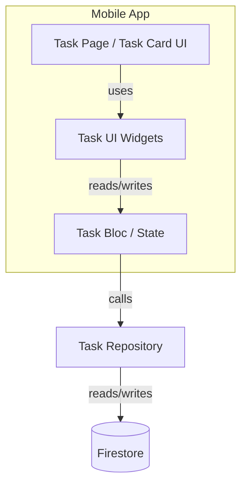
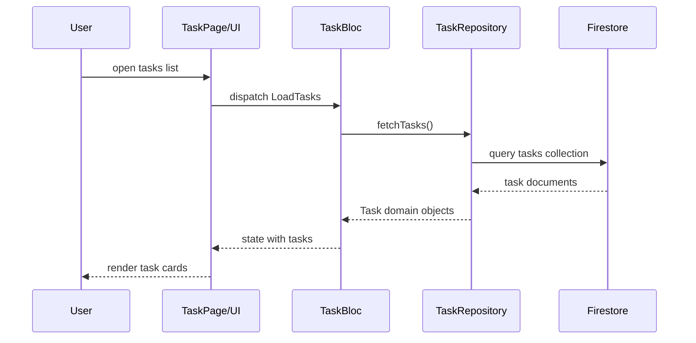

# Task Card Redesign — Feature Documentation

**Short description:** Redesign of the Task Card UI to improve readability, density and collapse/expand behavior while preserving existing task payloads and Firestore schema.

**Metadata**
- **Feature slug:** `feat-redesign-task-card`
- **Repository path:** `lib/src/modules/task/README.md`
- **Branch:** `feat/redesign-task-card`
- **Author / Generated by:** Documentation Agent
- **Date:** 2025-12-17
- **Status:** Draft

---

## Table of Contents
- Summary
- Important constraints
- Architecture overview (components & responsibilities)
- Data flow (diagrams and descriptions)
- Main functionalities & UX flow
- Navigation structure
- APIs & integrations
- Dependencies
- Implementation notes (key files & snippets)
- Tests & verification steps
- Security & privacy
- Troubleshooting & migration notes
- References & links

---

### Summary ✅
This feature modernizes the presentation of task items (Task Card), improving readability and enabling collapse/expand interactions. The UI changes must remain compatible with the current task model and Firestore-backed data model.

### Important constraints ⚠️
- Backwards compatibility: The UI must work with the existing `Task` payload shape.
- No server schema changes are assumed by default; any schema change must be coordinated with backend owners.
- Keep secrets and credentials redacted (agent detected Firebase integration; do not expose keys).

---

### Architecture overview 🔧
- Frontend: Flutter app (see `lib/src/**`) — UI components, pages, blocs/state management.
- Backend: Firebase (Firestore) for tasks persistence, accessed via injectables under `lib/src/modules/common/infrastructure/firebase/*`.
- Routing: `lib/src/router/app_router.dart` — `TaskPage` is the page entry point.

Mermaid component diagram:



---

### Data flow 💡
- Source: Firestore collection `tasks` (implementation found in Firestore helpers).
- Flow: On page open, the UI requests tasks from repository → repository maps DTOs (see `TaskDTO`) → UI renders list of task cards → user actions (toggle done, edit) dispatch events processed by bloc and persisted to Firestore.

Sequence diagram:



---

### Main functionalities & UX flow 🧭
- Show task list with redesigned card component.
- Collapse/expand details on each card.
- Toggle task completion (updates Firestore).
- Edit task content (navigates to edit flow or inline editor).

For each capability, include: Preconditions, Steps, Expected results.

Example: Toggle completion
- Preconditions: Network connected, user authenticated.
- Steps: Tap completion checkbox on card.
- Expected result: Card visually updates; Task repo writes `{isDone: true}` to Firestore; optimistic UI updates.

---

### Navigation structure 🗺️
- Entry: `TaskPage` (route defined in `lib/src/router/app_router.dart`).
- TaskCard appears inside the tasks list component on the `TaskPage`.

---

### APIs & integrations 🔗
- Firestore collection used for tasks (found in `lib/src/modules/common/infrastructure/firebase/*`).
- Auth: Firebase Auth is used in the project (`firebase_auth` dependency); operations likely require a signed-in user.

Example request patterns (internal):
- Read tasks: repository queries Firestore collection `tasks`.
- Write task update: repository writes document update `{ isDone: true }`.

---

### Dependencies 📦
- Flutter SDK (see `pubspec.yaml`) — project is Flutter/Dart.
- Firebase: `firebase_core`, `firebase_auth`, `cloud_firestore`.
- State & codegen: `flutter_bloc`, `freezed`, `json_serializable`, `injectable`.
- UI toolkit: `design_system` package.

---

### Implementation notes (key files & snippets) 🔍
Files discovered relevant to the feature:
- `lib/src/modules/task/presentation/pages/task_page.dart` — task page scaffold
- `lib/src/modules/common/domain/models/task.dart` — Task domain model
- `lib/src/modules/common/infrastructure/dto/task_dto.dart` — DTO mapping to domain
- Firestore helpers under `lib/src/modules/common/infrastructure/firebase/` — firestore helper functions and injection
- Router: `lib/src/router/app_router.dart` — route to `TaskPage`

Missing / TODOs (items agent could not locate):
- **Task Card widget file not found** (expected e.g., `lib/src/modules/task/presentation/widgets/task_card.dart`). If present, please provide path so docs can include detailed snippets and visual notes.
- Unit / widget tests for Task Card were not found — consider adding widget tests (`flutter_test`) to cover UI behavior (expand/collapse, toggle).

Important snippet example (DTO → domain mapping):

```dart
// lib/src/modules/common/infrastructure/dto/task_dto.dart
factory TaskDTO.fromDomain(Task task) => TaskDTO(
  uid: task.uid,
  title: task.title,
  content: task.content,
  isDone: task.isDone,
  dateCreated: task.dateCreated,
);
```

---

### Tests & verification ✅
Verification checklist performed by agent:
- [x] Located `Task` domain model and DTOs.
- [x] Located `TaskPage` route and reference in router.
- [x] Detected Firebase dependencies in `pubspec.yaml`.
- [ ] **Task Card widget file not found** — needs confirmation.
- [ ] No unit/widget tests located for `task` UI flows — recommend adding.

Manual QA steps:
- Run app, navigate to the Tasks page, verify redesigned card visuals and behaviors.
- Run `flutter test` and add widget tests for expand/collapse, checkbox toggle.

---

### Security & privacy 🔐
- The repo includes Firebase config files; do not commit or expose private keys. Agent redacted secrets and will not include them in documentation.
- Auth flow uses `firebase_auth`, ensure that rules for Firestore are correct and secure.

---

### Troubleshooting & migration notes 🛠️
- If performance issues appear when rendering many Task Cards, implement lazy list virtualization (e.g., `ListView.builder`) and avoid expensive widget rebuilds.
- If Firestore read costs increase, consider pagination or aggregation.

---

### References & links 📎
- Router: `lib/src/router/app_router.dart`
- Task page: `lib/src/modules/task/presentation/pages/task_page.dart`
- Task model/dto: `lib/src/modules/common/domain/models/task.dart`, `lib/src/modules/common/infrastructure/dto/task_dto.dart`
- Pubspec / dependencies: `pubspec.yaml`

---

## Next steps / Recommended actions
1. Confirm the path for the Task Card widget (if it exists) so documentation can include screenshots/snippets.
2. Add widget tests to cover Task Card behaviors (expand/collapse, toggle completion).
3. If you want, I can create focused widget-level docs & add example screenshots or assets to `lib/src/modules/task/assets/`.

---

*Generated by Documentation Agent — draft.*
<!-- AUTO-GENERATED DOC START -->
 # Task Module

The `task` module in this Dart/Flutter application is designed to manage and present task items within the application. This module focuses on enhancing the UI components, blocs, and state management related to tasks.

## Architecture Overview (Components & Responsibilities)

- **TaskCard**: A custom widget representing a single task item with expandable/collapsible sections for improved readability.
- **TasksBloc**: Manages the state of tasks, including fetching, adding, updating, and deleting tasks. It communicates with the TaskRepository to perform these operations.
- **TaskRepository**: Handles the data access layer for tasks using Firebase Firestore.
- **FirebaseModule**: An implementation detail that provides the dependency injection setup for Firebase services.

## Key Classes & Their Responsibilities

1. `TaskCard`: A widget responsible for presenting a task in an expandable/collapsible card format with all necessary information.
2. `TasksBloc`: Manages and exposes the state of tasks, providing streams for UI components to listen to updates.
3. `TaskRepository`: Handles the data access layer for tasks using Firebase Firestore. It interacts with the Firebase SDK for CRUD operations on tasks.
4. `FirebaseModule`: Configures the dependency injection setup for Firebase services, ensuring they are accessible throughout the application.

## Data Flow & State Management

The TasksBloc exposes streams of tasks and individual task details to UI components like the `TaskPage`. When a user interacts with these components (e.g., adding, editing, or deleting tasks), the bloc emits events, which are processed by the TaskRepository to perform the necessary operations on the Firestore-backed data.

## How To Use This Module

To use this module in your application, import the required packages and add the `TaskPage` to your navigation structure:

```dart
import 'package:flutter/material.dart';
import 'package:task_module/presentation/pages/task_page.dart';

void main() {
  runApp(MyApp());
}

class MyApp extends StatelessWidget {
  @override
  Widget build(BuildContext context) {
    return MaterialApp(
      title: 'Task App',
      home: TaskPage(),
      // Add other routes here...
    );
  }
}
```

Remember to include the `task_module` package in your `pubspec.yaml` file:

```yaml
dependencies:
  flutter:
    sdk: flutter
  task_module: ^1.0.0
```
<!-- AUTO-GENERATED DOC END -->
